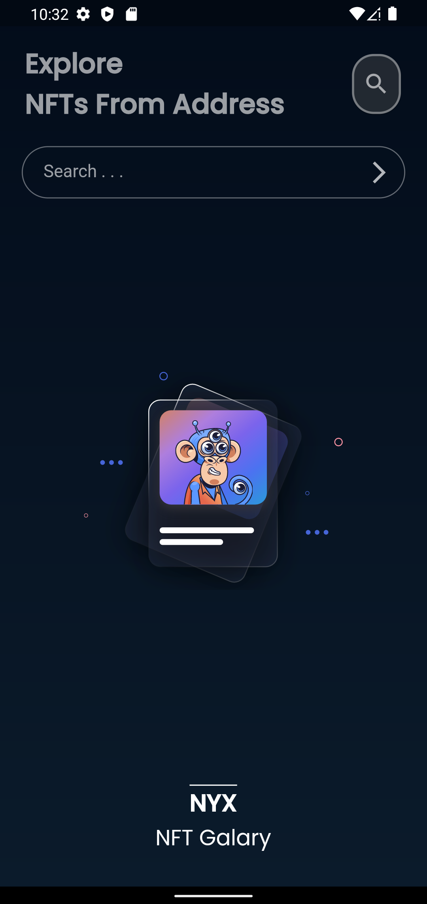
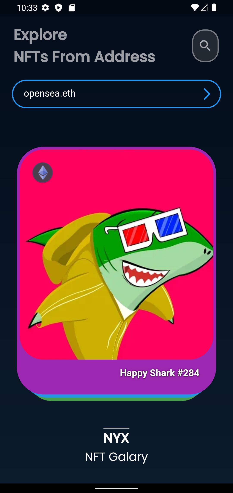
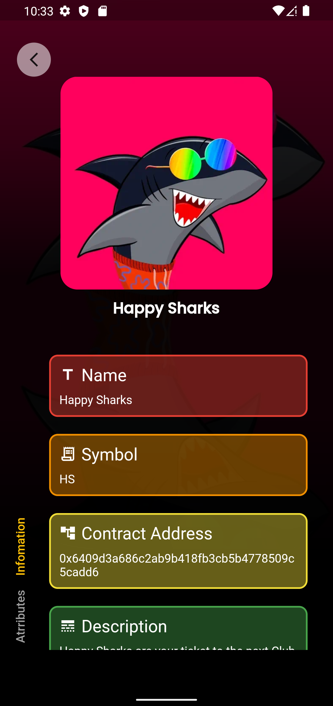

<a name="readme-top"></a>


[![Contributors][contributors-shield]][contributors-url]
[![Forks][forks-shield]][forks-url]
[![Stargazers][stars-shield]][stars-url]
[![Issues][issues-shield]][issues-url]
<!-- [![MIT License][license-shield]][license-url] -->
[![LinkedIn][linkedin-shield]][linkedin-url]


<br />
<div align="center">
  <a href="https://github.com/subrotokumar/nyx/">
    
  </a>

  <h3 align="center">NYX : NFT Gallery</h3>

  <p align="center">
    NFT-Explorer for Mobile Device
    <br />
    <a href="https://github.com/subrotokumar/nyx/releases"><strong>Download from <strong>Play Store</strong> »</strong></a>
    <br />
    <br />
    <a href="https://github.com/subrotokumar/nyx">View Demo</a>
    ·
    <a href="https://github.com/subrotokumar/nyx/issues">Report Bug</a>
    ·
    <a href="https://github.com/subrotokumar/nyx/issues">Request Feature</a>
  </p>
</div>


<!-- TABLE OF CONTENTS -->
<details>
  <summary>Table of Contents</summary>
  <ol>
    <li>
      <a href="#about-the-project">About The Project</a>
      <ul>
        <li><a href="#built-with">Built With</a></li>
      </ul>
    </li>
    <li>
      <a href="#getting-started">Getting Started</a>
      <ul>
        <li><a href="#prerequisites">Prerequisites</a></li>
        <li><a href="#installation">Installation</a></li>
      </ul>
    </li>
    <li><a href="#usage">Usage</a></li>
    <li><a href="#roadmap">Roadmap</a></li>
    <li><a href="#contributing">Contributing</a></li>
    <!-- <li><a href="#license">License</a></li> -->
    <li><a href="#contact">Contact</a></li>
    <li><a href="#acknowledgments">Acknowledgments</a></li>
  </ol>
</details>


<!-- ABOUT THE PROJECT -->
## About The Project
<br>
<p align='center'>
&nbsp;&nbsp;&nbsp;&nbsp;
</p>
<br>

NYX is NFT (non-fungible token) viewer application that allows users to view and explore unique digital assets, such as artwork, collectibles, and other digital items that are stored on a blockchain. These apps typically allow users to see NFT associated with the address, the metadata associated with the NFT, such as the creator, total supppy, etc. 

<p align="right">(<a href="#readme-top">back to top</a>)</p>


### Built With

This section should list any major frameworks/libraries used to this project:
- Flutter
- Dart
- Alchemy

<p align="right">(<a href="#readme-top">back to top</a>)</p>


<!-- GETTING STARTED -->
## Getting Started

This is an example of how you may give instructions on setting up your project locally.
To get a local copy up and running follow these simple example steps.

### Prerequisites

This is an example of how to list things you need to use the software and how to install them.
* Flutter SDK
* Android Studio

### Installation

1. Install Flutter SDK at your system.
2. Clone the repo
   ```sh
   git clone https://github.com/subrotokumar/nyk.git
   ```
3. Install flutter packages
   ```sh
   flutter pub get
   ```
4. Run application locally in debug mode
   ```sh
   flutter run --debug
   ```

<p align="right">(<a href="#readme-top">back to top</a>)</p>


<!-- USAGE EXAMPLES -->
## Usage

Use this space to show useful examples of how a project can be used. Additional screenshots, code examples and demos work well in this space. You may also link to more resources.

_For more examples, please refer to the [Documentation](https://example.com)_

<p align="right">(<a href="#readme-top">back to top</a>)</p>


<!-- ROADMAP -->
## Roadmap

- [ ] Polygon network support
- [ ] Search collection
- [ ] Save favorites

See the [open issues](https://github.com/subrotokumar/nyx/issues) for a full list of proposed features (and known issues).

<p align="right">(<a href="#readme-top">back to top</a>)</p>


<!-- CONTRIBUTING -->
## Contributing

Contributions are what make the open source community such an amazing place to learn, inspire, and create. Any contributions you make are **greatly appreciated**.

If you have a suggestion that would make this better, please fork the repo and create a pull request. You can also simply open an issue with the tag "enhancement".
Don't forget to give the project a star! Thanks again!

1. Fork the Project
2. Create your Feature Branch (`git checkout -b feature/FeatureName`)
3. Commit your Changes (`git commit -m 'Added FeatureName'`)
4. Push to the Branch (`git push origin feature/FeatureName`)
5. Open a Pull Request

<p align="right">(<a href="#readme-top">back to top</a>)</p>

<!-- LICENSE -->


<!-- CONTACT -->
## Contact

Subroto Kumar - [@subrotokr](https://twitter.com/subrotokr) - subrotokumar@outlook.in

Project Link: [https://github.com/subrotokumar/nyx](https://github.com/subrotokumar/nyx)

<p align="right">(<a href="#readme-top">back to top</a>)</p>


<!-- ACKNOWLEDGMENTS -->
## Acknowledgments

* Alchemy
* Flaticon
* Icon8
* LottieFiles.com

<p align="right">(<a href="#readme-top">back to top</a>)</p>


<!-- MARKDOWN LINKS & IMAGES -->
<!-- https://www.markdownguide.org/basic-syntax/#reference-style-links -->
[contributors-shield]: https://img.shields.io/github/contributors/subrotokumar/nyx.svg?style=for-the-badge
[contributors-url]: https://github.com/subrotokumar/nyx/graphs/contributors
[forks-shield]: https://img.shields.io/github/forks/subrotokumar/nyx.svg?style=for-the-badge
[forks-url]: https://github.com/subrotokumar/nyx/network/members
[stars-shield]: https://img.shields.io/github/stars/subrotokumar/nyx.svg?style=for-the-badge
[stars-url]: https://github.com/subrotokumar/nyx/stargazers
[issues-shield]: https://img.shields.io/github/issues/subrotokumar/nyx.svg?style=for-the-badge
[issues-url]: https://github.com/subrotokumar/nyx/issues
[license-shield]: https://img.shields.io/github/license/subrotokumar/nyx.svg?style=for-the-badge
[license-url]: https://www.linkedin.com/in/kumarsubroto
[linkedin-shield]: https://img.shields.io/badge/-LinkedIn-black.svg?style=for-the-badge&logo=linkedin&colorB=555
[linkedin-url]: https://linkedin.com/in/kumarsubroto
[product-screenshot]: ./assets/images/banner.png
